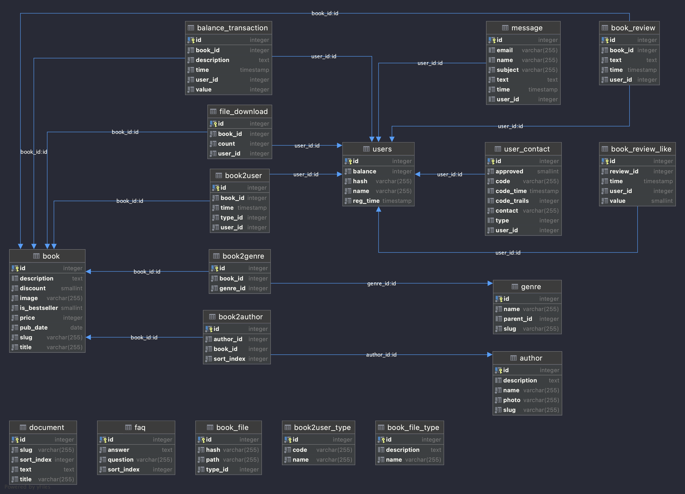

# bookshop

## Навигация

- [Бизнес требования](#Бизнес-требования)
- [Архитектура приложения](#Архитектура-приложения)
- [Модель данных](#Модель-данных)
- [Точки доступа](#Точки-доступа)
    - [Адреса и порты](#Адреса-и-порты)
    - [Учетные записи](#Учетные-записи)
- [Как запустить](#Как-запустить)
    - [Запуск приложения](#Запуск-приложения)
    - [Frontend запросы](#Frontend-запросы)
    - [Подключение к БД](#Подключение-к-БД)
      - [Создание БД в Docker](#Создание-БД-в-Docker)
- [Backlog](#Backlog)

## Бизнес требования

[Техническое задание.docx](https://github.com/Goganesh/bookshop/blob/master/docs/%D0%A2%D0%B5%D1%85%D0%BD%D0%B8%D1%87%D0%B5%D1%81%D0%BA%D0%BE%D0%B5%20%D0%B7%D0%B0%D0%B4%D0%B0%D0%BD%D0%B8%D0%B5%20%D0%B4%D0%BB%D1%8F%20%D1%81%D1%82%D1%83%D0%B4%D0%B5%D0%BD%D1%82%D0%BE%D0%B2.docx)

[Диплом часть 1.pdf](https://github.com/Goganesh/bookshop/blob/master/docs/%D0%94%D0%B8%D0%BF%D0%BB%D0%BE%D0%BC.%20%D0%A7%D0%B0%D1%81%D1%82%D1%8C%201.pdf)

[Диплом часть 2.pdf](https://github.com/Goganesh/bookshop/blob/master/docs/%D0%94%D0%B8%D0%BF%D0%BB%D0%BE%D0%BC.%20%D0%A7%D0%B0%D1%81%D1%82%D1%8C%202.pdf)

Приложение выполняет следующие бизнес-функции:
- сайт - магазин книг;
- панель администратора:
  - CRUD жанров;
  - CRUD книг;
  - Смена изображения для книг;
  - CRUD авторов;
  - RUD пользователей;
  - RUD отзывов;

## Архитектура приложения

Приложение написано с использованием Spring-Boot фреймворка. 

В качестве сборщика проекта выбран Maven.

В качестве базы данных используется PostgreSQl.

Мультимодульный проект:

| Модуль        | Обязанность                                                                                                                                                                           |                  
|:--------------|:--------------------------------------------------------------------------------------------------------------------------------------------------------------------------------------|
| application   | Запуск приложения. Содержит конфигурацию всего проекта.                                                                                                                               |
| common        | Обработка бизнес логики.                                                                                                                                                              |
| migration     | Миграция стуктуры и данных в СУБД. Миграция данных выполняется средствами Liquibase.                                                                                                  |
| model         | Взаимодейстие с СУБД. Содержит pojo модель (Entity) и реализацию взаимодейстивя с СУБД. Слой доступа к БД.                                                                            |
| otp           | Рассылки одноразовых паролей. Рассылка поддерживается по телефону и эл. почте.                                                                                                        |
| security      | Аутентификация и авторизация. Может быть применена к любому слою для обеспечения безопасности.                                                                                        |
| web-api       | Предоставление API. Слой отвечает за принятие REST запросов из браузера клиента.                                                                                                      |
| web-ui-admin  | Отображение web страниц панели администратора. Состоит из статических HTML файлов и клиентской логики с использованием Java Script. В качестве web-сервера выступает само приложение. |
| web-ui-client | Отображение web страниц сайта. Состоит из статических HTML файлов и клиентской логики с использованием Java Script. В качестве web-сервера выступает само приложение.                 |

## Модель данных

[Стуктура БД.docx](https://github.com/Goganesh/bookshop/blob/master/docs/%D0%A1%D1%82%D1%80%D1%83%D0%BA%D1%82%D1%83%D1%80%D0%B0%20%D0%91%D0%94%20%E2%80%94%20%D0%B4%D0%B8%D0%BF%D0%BB%D0%BE%D0%BC%20Spring.docx)

## Точки доступа

### Адреса и порты
| Функция                        | Адрес          |                  
|:-------------------------------|:---------------|
|   Точка доступа к приложению   | localhost:8085 | 

### Учетные записи
Аутентификация выполняется при помощи ОТП паролей

| Почта             | Телефон    | Пароль                               | Роль  |                  
|:------------------|:-----------|:-------------------------------------|:------|
| admin@mail.ru     | 9267777777 | ОТП пароль смотри в логах приложения | ADMIN |
| basiladze@mail.ru | 9168313181 | ОТП пароль смотри в логах приложения | USER  |

## Как запустить

### Запуск приложения

Для сборки и запуска приложения вам понадобиться:
- JDK 13
- Maven

Запустить цикл **install** в модуле **application**.

В результате получим исполняемый **jar** файл в директории **target**.  

### Frontend запросы

swagger ui доступен по ресурсу -  /swagger-ui.html

openapi спецификация доступна по ресурсу - /api-docs

[ТЗ на разработку API](https://github.com/Goganesh/bookshop/blob/master/docs/swagger.yaml)

### Подключение к БД

Переменные окружения для подключения к БД:
- SPRING_DATASOURCE_URL
- SPRING_DATASOURCE_USERNAME
- SPRING_DATASOURCE_PASSWORD
- SPRING_DATASOURCE_DRIVER

Параметры подключения по умолчанию:
- url: jdbc:postgresql://localhost:5432/postgres
- driverClassName: org.postgresql.Driver
- username: postgres
- password: postgres1

#### Создание БД в Docker
1. Загрузка image БД PostgreSQL`docker pull postgres`
2. Запуск контейнера `docker run --rm --name=myContainer --env="POSTGRES_PASSWORD=postgres1" --publish 5432:5432 -d postgres`
3. Для дополнительного доступа к СУБД (для создания бд/схемы):
   1. Вызов контейнера `docker exec -it myContainer bash`
   2. Переключение на пользователя `su postgres`
   3. Вызов консоли `psql`

## Backlog
- добавить поля аудита в entity: created_at, created_by, updated_at, updated_by
- добавить soft delete: подавить поле is_enabled в модель данных
- добавить сервис генерации и валидации слаг
- добавить мониторинг покрытия юнит тестами + определить целевое покрытие
- оценить todo к коде
- полная локалицаия сайта (сейчас частияная)
- добавить функцию по уведолмению пользователей
- добавить актуатор и админку для мониторинга работы приложения 
- удаление временных пользователей (TEMP_USER) с определенной периодичностью 
- добавить входе через mail.ru, vk
- создание пользоателя при первом входе через внешние сервисы (mail.ru, vk, google)
- обогащение данных пользователей при входе через внешние сервисы (mail.ru, vk, google)
- восстановление пароля
- покупка книги
- выгрузка книг
- сделать код чистым в модуле security
- защита от ddos атак
- добавить https
- get token model where read token from string
- рефакторинг решения по попыткам входа в систему 
- валидация (validated) модели формы регистрации